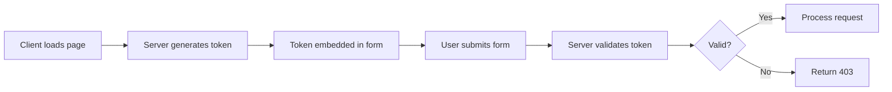

# 📡 API Dokumentace - Project Delta

## API Přehled

Project Delta API poskytuje backend služby pro zpracování formulářů a komunikaci s externími službami.

## Base URL

```
Development: http://localhost:4321/api
Production: https://your-domain.com/api
```

## Autentizace

Aktuálně API nevyžaduje autentizaci, ale implementuje:

- CSRF token validaci
- Rate limiting
- Origin checking

## Endpoints

### 📧 POST /api/send

Zpracování a odeslání kontaktního formuláře.

#### Request

**URL**: `/api/send`  
**Method**: `POST`  
**Content-Type**: `application/json`

**Headers**:

```http
Content-Type: application/json
Origin: https://your-domain.com
```

**Body**:

```json
{
  "name": "string",
  "phone": "string",
  "email": "string",
  "industry": "string",
  "budget": "string",
  "helpNeeded": "string",
  "csrfToken": "string"
}
```

**Field Specifications**:

| Field      | Type   | Required | Validation    | Description         |
| ---------- | ------ | -------- | ------------- | ------------------- |
| name       | string | ✅       | 2-100 chars   | Celé jméno kontaktu |
| phone      | string | ✅       | Regex pattern | Telefonní číslo     |
| email      | string | ✅       | RFC 5322      | Email adresa        |
| industry   | string | ✅       | 2-100 chars   | Odvětví podnikání   |
| budget     | string | ✅       | Enum          | Rozpočet projektu   |
| helpNeeded | string | ✅       | 10-1000 chars | Popis potřeby       |
| csrfToken  | string | ✅       | 64 hex chars  | CSRF token          |

**Budget Enum Values**:

- `"40 000"`
- `"80 000"`
- `"150 000"`
- `"150 000+"`

#### Response

**Success Response**:

```http
HTTP/1.1 200 OK
Content-Type: application/json
```

```json
{
  "message": "E-maily byly úspěšně odeslány.",
  "data": {
    "admin": {
      "id": "email-id-admin",
      "from": "omega@vojtechkochta.cz",
      "to": ["info@vojtechkochta.cz"],
      "subject": "Nová poptávka (web): Jan Novák"
    },
    "confirmation": {
      "id": "email-id-confirmation",
      "from": "omega@vojtechkochta.cz",
      "to": ["user@example.com"],
      "subject": "Potvrzení přijetí poptávky"
    }
  }
}
```

**Error Responses**:

##### 400 Bad Request

```json
{
  "error": "Jméno musí obsahovat 2-100 znaků."
}
```

##### 403 Forbidden

```json
{
  "error": "Chybí bezpečnostní token. Obnovte stránku a zkuste to znovu."
}
```

##### 429 Too Many Requests

```http
HTTP/1.1 429 Too Many Requests
Retry-After: 900
Content-Type: application/json
```

```json
{
  "error": "Příliš mnoho požadavků. Zkuste to prosím později."
}
```

##### 500 Internal Server Error

```json
{
  "error": "Nastala neznámá chyba."
}
```

#### Example Request

```javascript
const formData = {
  name: 'Jan Novák',
  phone: '+420 777 888 999',
  email: 'jan.novak@example.com',
  industry: 'E-commerce',
  budget: '150 000',
  helpNeeded: 'Potřebuji vytvořit e-shop s napojením na skladový systém.',
  csrfToken: 'a1b2c3d4e5f6...',
};

const response = await fetch('/api/send', {
  method: 'POST',
  headers: {
    'Content-Type': 'application/json',
  },
  body: JSON.stringify(formData),
});

const result = await response.json();
```

#### cURL Example

```bash
curl -X POST https://your-domain.com/api/send \
  -H "Content-Type: application/json" \
  -d '{
    "name": "Jan Novák",
    "phone": "+420 777 888 999",
    "email": "jan.novak@example.com",
    "industry": "E-commerce",
    "budget": "150 000",
    "helpNeeded": "Potřebuji vytvořit e-shop.",
    "csrfToken": "a1b2c3d4e5f6..."
  }'
```

## Rate Limiting

### Limity

| Endpoint  | Limit      | Window     | Per |
| --------- | ---------- | ---------- | --- |
| /api/send | 3 requests | 15 minutes | IP  |

### Rate Limit Headers

```http
X-RateLimit-Limit: 3
X-RateLimit-Remaining: 2
X-RateLimit-Reset: 1703001234567
```

### Rate Limit Exceeded Response

```http
HTTP/1.1 429 Too Many Requests
Retry-After: 900
Content-Type: application/json

{
  "error": "Příliš mnoho požadavků. Zkuste to prosím později."
}
```

## Error Handling

### Error Response Format

```typescript
interface ErrorResponse {
  error: string; // Human-readable error message in Czech
  code?: string; // Optional error code for programmatic handling
  details?: any; // Optional additional error details
}
```

### Common Error Codes

| HTTP Status | Error Code          | Description               |
| ----------- | ------------------- | ------------------------- |
| 400         | INVALID_INPUT       | Neplatná vstupní data     |
| 400         | MISSING_FIELD       | Chybějící povinné pole    |
| 403         | CSRF_INVALID        | Neplatný CSRF token       |
| 403         | CSRF_MISSING        | Chybějící CSRF token      |
| 429         | RATE_LIMIT          | Překročen limit požadavků |
| 500         | INTERNAL_ERROR      | Interní chyba serveru     |
| 503         | SERVICE_UNAVAILABLE | Služba dočasně nedostupná |

## CSRF Token Management

### Získání CSRF tokenu

CSRF token je generován při načtení stránky s formulářem a je součástí HTML:

```html
<input type="hidden" name="csrf_token" value="generated-token-here" />
```

### Token Specifications

- **Algorithm**: crypto.randomBytes
- **Length**: 64 hexadecimal characters
- **Entropy**: 256 bits
- **Lifetime**: Per page load
- **Validation**: Server-side length check

### Token Validation Flow



## Webhooks (Future)

### Planned Webhook Events

```json
{
  "event": "form.submitted",
  "timestamp": "2024-01-01T12:00:00Z",
  "data": {
    "id": "form-123",
    "email": "user@example.com",
    "status": "success"
  }
}
```

## Testing

### Test Environment

```
URL: http://localhost:4321/api
CSRF: Disabled for testing
Rate Limit: 10 req/min (relaxed)
```

### Postman Collection

```json
{
  "info": {
    "name": "Project Delta API",
    "schema": "https://schema.getpostman.com/json/collection/v2.1.0/collection.json"
  },
  "item": [
    {
      "name": "Send Contact Form",
      "request": {
        "method": "POST",
        "url": "{{baseUrl}}/api/send",
        "body": {
          "mode": "raw",
          "raw": "{\n  \"name\": \"Test User\",\n  \"phone\": \"+420 777 888 999\",\n  \"email\": \"test@example.com\",\n  \"industry\": \"Testing\",\n  \"budget\": \"40 000\",\n  \"helpNeeded\": \"Test message for API testing purposes.\",\n  \"csrfToken\": \"{{csrfToken}}\"\n}"
        }
      }
    }
  ]
}
```

### Unit Test Example

```typescript
import { describe, it, expect } from 'vitest';

describe('API /send', () => {
  it('should accept valid form data', async () => {
    const response = await fetch('/api/send', {
      method: 'POST',
      headers: { 'Content-Type': 'application/json' },
      body: JSON.stringify(validFormData),
    });

    expect(response.status).toBe(200);
    const data = await response.json();
    expect(data.message).toBeDefined();
  });

  it('should reject invalid email', async () => {
    const invalidData = { ...validFormData, email: 'invalid' };
    const response = await fetch('/api/send', {
      method: 'POST',
      headers: { 'Content-Type': 'application/json' },
      body: JSON.stringify(invalidData),
    });

    expect(response.status).toBe(400);
  });
});
```

## Performance

### Response Times

| Percentile | Time (ms) | Description     |
| ---------- | --------- | --------------- |
| P50        | < 100     | Median          |
| P95        | < 300     | 95th percentile |
| P99        | < 500     | 99th percentile |

### Optimization Tips

1. **Connection Pooling**: Reuse email service connections
2. **Caching**: Cache CSRF tokens in Redis
3. **Async Processing**: Queue email sending
4. **CDN**: Use CDN for static assets

## Monitoring

### Health Check Endpoint (Planned)

```http
GET /api/health

Response:
{
  "status": "healthy",
  "timestamp": "2024-01-01T12:00:00Z",
  "services": {
    "email": "operational",
    "database": "operational"
  }
}
```

### Metrics to Monitor

- Request rate
- Error rate
- Response time
- Email delivery rate
- Rate limit hits

## Versioning

### Current Version

```
v1 (implicit, no versioning in URL)
```

### Future Versioning Strategy

```
/api/v1/send  # Version 1
/api/v2/send  # Version 2 (breaking changes)
```

### Deprecation Policy

- Announce deprecation 3 months in advance
- Maintain deprecated versions for 6 months
- Provide migration guide

## SDK Examples (Future)

### JavaScript/TypeScript SDK

```typescript
import { ProjectDeltaAPI } from '@project-delta/sdk';

const api = new ProjectDeltaAPI({
  baseURL: 'https://your-domain.com',
  timeout: 5000,
});

const result = await api.sendContactForm({
  name: 'Jan Novák',
  email: 'jan@example.com',
  // ... other fields
});
```

### Python SDK

```python
from project_delta import API

api = API(base_url="https://your-domain.com")

result = api.send_contact_form(
    name="Jan Novák",
    email="jan@example.com",
    # ... other fields
)
```

## Support

### API Support Channels

- **Documentation**: This document
- **Issues**: GitHub Issues
- **Email**: api-support@vojtechkochta.cz
- **Status Page**: status.your-domain.com

### SLA

- **Uptime Target**: 99.9%
- **Response Time**: < 24 hours
- **Maintenance Window**: Sunday 02:00-04:00 CET

---

_API Documentation v1.0.0_
_Last Updated: December 2024_
_OpenAPI Spec: Coming Soon_
