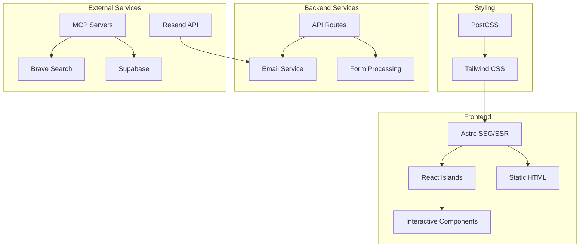
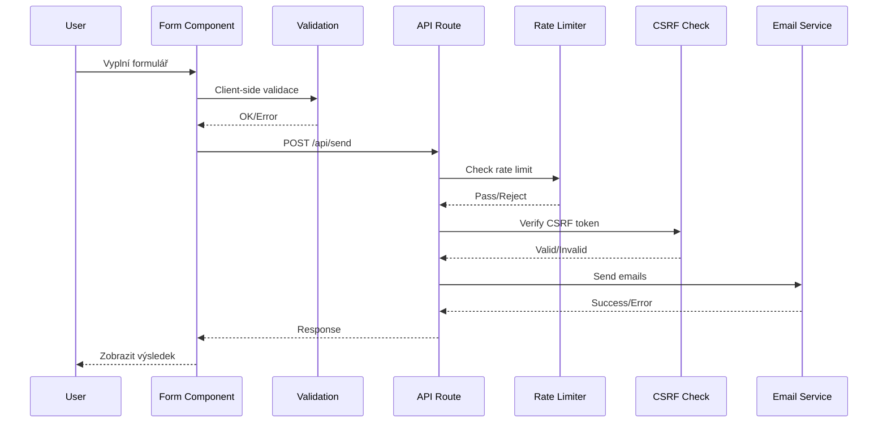

# 🏗️ Architektura aplikace Project Delta

## Přehled architektury

Project Delta je postavena na moderní JAMstack architektuře s následujícími charakteristikami:



## Architektonické principy

### 1. **Island Architecture**

- Astro poskytuje statický HTML
- React komponenty jsou "ostrovy" interaktivity
- Minimální JavaScript payload
- Optimální performance

### 2. **Component-Based Design**

```
components/
├── Astro Components (SSG/SSR)
│   └── Statický obsah, layout, struktura
└── React Components (Client)
    └── Interaktivní prvky, animace, state
```

### 3. **Separation of Concerns**

- **Prezentační vrstva**: Astro + React komponenty
- **Business logika**: API routes
- **Styling**: Tailwind CSS + PostCSS
- **Animace**: Motion/GSAP/Three.js

## Datový tok

### Formulářový submit flow



## Komponentová hierarchie

### Hlavní stránka (index.astro)

```
Layout.astro
├── Navbar.astro
│   ├── Logo.astro
│   ├── Menu.astro
│   └── NavbarContainer.tsx (React)
│       ├── MobileMenu.tsx
│       ├── SplitModal.tsx
│       └── NavbarScrollEffects.tsx
├── Hero.astro
│   ├── InfoSection.astro
│   │   └── BlurText.tsx
│   ├── PortraitImage.astro
│   │   └── GridDistortion.tsx
│   └── SocialProof.astro
├── Services.astro
│   ├── ServiceBentoGrid.astro
│   └── ServiceMagicEffects.tsx
├── Portfolio.astro
│   └── PortfolioContainer.tsx
│       ├── PortfolioGrid.tsx
│       └── PortfolioLightbox.tsx
├── Form.astro
│   └── Client-side React hooks
└── Footer.astro
```

## Rendering strategie

### 1. **Static Generation (SSG)**

- Většina obsahu je předgenerována při buildu
- Rychlé načítání, SEO friendly
- Použito pro: Layout, Hero, Services, Portfolio shells

### 2. **Server-Side Rendering (SSR)**

- API routes pro dynamický obsah
- CSRF token generování
- Form processing

### 3. **Client-Side Rendering (CSR)**

- React komponenty pro interaktivitu
- Animace a efekty
- Form validation a state management

### Hydration strategie

```astro
<!-- Načte se okamžitě -->
<Component client:load />

<!-- Načte se při nečinnosti -->
<Component client:idle />

<!-- Načte se při vstupu do viewport -->
<Component client:visible />

<!-- Pouze na klientu, žádné SSR -->
<Component client:only="react" />
```

## State Management

### Lokální state

```typescript
// Komponenta level state
const [isOpen, setIsOpen] = useState(false);
```

### Props drilling

```typescript
// Parent → Child komunikace
<ChildComponent
  data={data}
  onUpdate={handleUpdate}
/>
```

### Event system

```typescript
// Custom events pro cross-component komunikaci
window.dispatchEvent(
  new CustomEvent('menuToggle', {
    detail: { isOpen: true },
  })
);
```

## Bezpečnostní architektura

### Vrstvy zabezpečení

1. **Network Level**
   - HTTPS only
   - Security headers
   - CORS policy

2. **Application Level**
   - CSRF protection
   - Input validation
   - Rate limiting
   - Honeypot fields

3. **Data Level**
   - Input sanitization
   - Type checking
   - Environment variables pro secrets

### Bezpečnostní flow

```
Request → Rate Limit → CSRF Check → Validation → Sanitization → Processing
```

## Performance architektura

### Optimalizační strategie

1. **Code Splitting**
   - Automatické dělení kódu Astrem
   - Lazy loading React komponent
   - Dynamic imports

2. **Asset Optimization**
   - WebP obrazové formáty
   - Responsive images
   - Font subsetting
   - CSS purging

3. **Caching Strategy**

   ```
   Static Assets → CDN Cache → Browser Cache
   API Responses → No cache (security)
   ```

4. **Bundle Optimization**
   - Tree shaking
   - Minification
   - Compression (gzip/brotli)

## Animační architektura

### Vrstvy animací

1. **CSS Animations** (Nejlehčí)
   - Transitions
   - Keyframes
   - Tailwind utilities

2. **Motion/Framer** (Střední)
   - React komponenty
   - Gesture handling
   - Layout animations

3. **GSAP** (Komplexní)
   - Timeline animations
   - ScrollTrigger
   - Complex sequences

4. **WebGL/Three.js** (Nejtěžší)
   - 3D efekty
   - Shader animations
   - GPU accelerated

### Performance budget

```
CSS Animations: < 10ms
React Animations: < 16ms (60fps)
WebGL: < 33ms (30fps minimum)
```

## API architektura

### Endpoint struktura

```
/api/
├── send.ts          # Form submission
├── [future endpoints]
```

### Request/Response format

```typescript
// Request
{
  headers: {
    'Content-Type': 'application/json'
  },
  body: {
    ...formData,
    csrfToken: string
  }
}

// Response
{
  status: 200 | 400 | 403 | 429 | 500,
  body: {
    message?: string,
    error?: string,
    data?: any
  }
}
```

## Deployment architektura

### Build pipeline

```
Source Code → Linting → Type Check → Build → Optimize → Deploy
```

### Environment stages

```
Development → Staging → Production
localhost:4321 → preview → production domain
```

### Scalability considerations

1. **Horizontal Scaling**
   - Stateless application
   - CDN distribution
   - Load balancing ready

2. **Vertical Scaling**
   - Optimized bundle size
   - Efficient memory usage
   - Minimal CPU overhead

## Monitoring a observability

### Metriky ke sledování

1. **Performance Metrics**
   - First Contentful Paint (FCP)
   - Largest Contentful Paint (LCP)
   - Time to Interactive (TTI)
   - Cumulative Layout Shift (CLS)

2. **Business Metrics**
   - Form submission rate
   - API response times
   - Error rates
   - User engagement

3. **Security Metrics**
   - Rate limit hits
   - CSRF failures
   - Validation errors
   - Suspicious patterns

## Budoucí rozšíření

### Plánované vylepšení

1. **Backend Services**
   - Database integration (Supabase)
   - User authentication
   - CMS integration

2. **Performance**
   - Service Worker
   - PWA capabilities
   - Edge functions

3. **Features**
   - Multi-language support
   - A/B testing
   - Analytics dashboard

---

_Architecture Documentation v1.0.0_
_Poslední aktualizace: Prosinec 2024_
